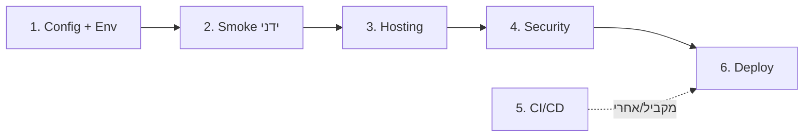

# Roadmap: מהנקודה הנוכחית עד Deploy

## מצב נוכחי (מרץ 2025)

- **אפליקציה**: Next.js 16 (App Router), Supabase (Auth + DB), Resend (email), שאלון DSM + תוכניות עסקיות.
- **איכות**: 100 טסטים עוברים, build עובר, רשימת בדיקות ידניות ב־`docs/manual-smoke-checklist.md`.
- **חסר**: אין Dockerfile, אין vercel.json, `.env.example` חלקי, אין pipeline ייעודי ל־CI/CD.

---

## שלב 1 — הכנת סביבה ו־Config (חצי יום)

| # | משימה | פרטים |
|---|--------|--------|
| 1.1 | **השלמת `.env.example`** | להוסיף: `NEXT_PUBLIC_APP_URL`, `RESEND_API_KEY`, `RESEND_FROM`, `RESEND_TO`. לתעד אילו חובה לאיפוס/production. |
| 1.2 | **ייצוב אזהרת Build** | אם קיים lockfile מחוץ לפרויקט — להגדיר `outputFileTracingRoot` ב־[next.config.ts](next.config.ts) (נתיב לשורש המונורפו/פרויקט). |
| 1.3 | **Supabase Production** | ליצור פרויקט Supabase ל־production ולהריץ מיגרציות לפי הסדר. **הוראות מפורטות:** [docs/setup-supabase-production.md](setup-supabase-production.md). |
| 1.4 | **Google OAuth (אם רלוונטי)** | להפעיל ב־Supabase Auth את Google provider; להגדיר Client ID/Secret ב־Google Cloud ולהזין ב־Supabase. **הוראות:** [docs/setup-supabase-production.md](setup-supabase-production.md#14-google-oauth). |

**תוצר**: `.env.example` מלא, build ללא אזהרות מיותרות, DB ו־Auth מוכנים ל־production.

---

## שלב 2 — בדיקות ידניות ו־Smoke (חצי יום – יום)

| # | משימה | פרטים |
|---|--------|--------|
| 2.1 | **הרצת הרשימה הידנית** | למלא [docs/manual-smoke-checklist.md](manual-smoke-checklist.md): לוגין, דשבורד, self-serve הערכה, תוכנית + היסטוריה, מובייל, auth callback ללא code, token לא קיים. |
| 2.2 | **תיקון באגים** | לתעד ולטפל בכל פריט שנכשל ברשימה. |
| 2.3 | **אופציונלי: E2E** | אם רוצים אוטומציה — להוסיף Playwright/Cypress ולכסות לוגין + דשבורד + זרימת הערכה אחת. לא חובה ל־deploy ראשון. |

**תוצר**: רשימת smoke מסומנת (עבר/נכשל), ובאגים קריטיים מטופלים.

---

## שלב 3 — פלטפורמת Hosting והגדרות (חצי יום)

בחירה אחת מהאפשרויות:

### אופציה A: Vercel (מומלץ ל־Next.js)

| # | משימה | פרטים |
|---|--------|--------|
| 3.A.1 | **חיבור Repo** | לחבר את ה־repo ל־Vercel (GitHub/GitLab/Bitbucket). |
| 3.A.2 | **Environment Variables** | להגדיר ב־Vercel את כל המשתנים מ־`.env.example` (כולל Supabase production, Resend, `NEXT_PUBLIC_APP_URL` = כתובת ה־Vercel). |
| 3.A.3 | **Build & Output** | Root Directory = שורש הפרויקט; Build Command: `npm run build`; Output = default (Next.js). |
| 3.A.4 | **אופציונלי: vercel.json** | רק אם נדרש — redirects, headers, או הגבלת routes. |

### אופציה B: Docker (VPS / VM / אונ-פרימיס)

| # | משימה | פרטים |
|---|--------|--------|
| 3.B.1 | **Dockerfile** | multi-stage: `node` — install, build; then `node:alpine` — copy `.next/standalone` + static, `CMD ["node", "server.js"]`. |
| 3.B.2 | **Next.js output** | להפעיל `output: 'standalone'` ב־[next.config.ts](next.config.ts) כדי לאפשר הרצה עם `node server.js`. |
| 3.B.3 | **העברת env** | להעביר env ב־runtime (לא להטמיע secrets ב־image). |

### אופציה C: פלטפורמה אחרת (Netlify, Railway, וכו')

| # | משימה | פרטים |
|---|--------|--------|
| 3.C.1 | **התאמת Build** | Build command: `npm run build`; Publish directory: `.next` או לפי דרישות הפלטפורמה ל־Next.js. |
| 3.C.2 | **Env** | להגדיר את אותם משתנים כמו ב־.env.example. |

**תוצר**: פרויקט מחובר ל־hosting, build רץ בהצלחה בסביבת ה־host.

---

## שלב 4 — Production Env ו־Security (חצי יום)

| # | משימה | פרטים |
|---|--------|--------|
| 4.1 | **Supabase URL redirect** | ב־Supabase Dashboard → Authentication → URL Configuration: להגדיר Site URL ו־Redirect URLs לכתובת ה־production (למשל `https://your-app.vercel.app`, `https://your-app.vercel.app/auth/callback`). |
| 4.2 | **Resend domain** | אם שולחים מייל מ־domain מותאם — לאמת domain ב־Resend. אחרת אפשר להשאיר `onboarding@resend.dev`. |
| 4.3 | **Rate limiting / הגנה** | אופציונלי: הגבלת rate ל־API routes (למשל `/api/`) או שימוש בשירות חיצוני. לא חובה ל־MVP. |
| 4.4 | **HTTPS** | וודא ש־hosting מספק HTTPS (ברירת מחדל ב־Vercel/Netlify). |

**תוצר**: Auth ו־callback עובדים ב־production; מיילים נשלחים; HTTPS פעיל.

---

## שלב 5 — CI/CD (אופציונלי אך מומלץ)

| # | משימה | פרטים |
|---|--------|--------|
| 5.1 | **GitHub Actions (או מקביל)** | workflow: on push to main — `npm ci`, `npm run lint`, `npm test`, `npm run build`. כישלון = חסימת merge / deploy. |
| 5.2 | **Deploy אוטומטי** | ב־Vercel/Netlify — deploy על push ל־main; ב־Docker — build image ו־push ל־registry, ולמשוך ב־VPS. |

**תוצר**: כל push עובר טסטים ו־build; production מתעדכן אוטומטית (או אחרי אישור).

---

## שלב 6 — Deploy ראשון ו־Post-Deploy

| # | משימה | פרטים |
|---|--------|--------|
| 6.1 | **Deploy** | להפעיל deploy (Vercel: "Deploy", Docker: להריץ container עם env נכון). |
| 6.2 | **Smoke ב־production** | להריץ שוב את הרשימה ב־[manual-smoke-checklist.md](manual-smoke-checklist.md) על כתובת ה־production. |
| 6.3 | **ניטור** | לבדוק לוגים (Vercel Logs / Docker logs) על 404, 500, ושגיאות Auth. |
| 6.4 | **גיבוי ו־RTO** | לתעד: איך משחזרים DB (Supabase backups), איך מחזירים גרסה קודמת (revert ב־Vercel / rollback image). |

**תוצר**: אפליקציה חיה ב־production; smoke עבר; יש תיעוד recovery בסיסי.

---

## סדר ביצוע מומלץ (Timeline)

| שלב | משך משוער |
|-----|------------|
| 1. Config + Env | חצי יום |
| 2. Smoke ידני | חצי יום – יום |
| 3. Hosting | חצי יום |
| 4. Security | חצי יום |
| 5. CI/CD | חצי יום (אופציונלי) |
| 6. Deploy + smoke production | חצי יום |
| **סה"כ (ללא E2E)** | **כ־2.5–3.5 ימי עבודה** |

---

## Checklist לפני Deploy

- [ ] `.env.example` מעודכן עם כל המשתנים הנדרשים
- [ ] מיגרציות Supabase הורצו ב־production
- [ ] Google OAuth (אם נדרש) מוגדר ב־Supabase + Google Cloud
- [ ] רשימת הבדיקות הידניות ב־`docs/manual-smoke-checklist.md` בוצעה ועברה
- [ ] פלטפורמת hosting מחוברת; env מוגדר
- [ ] Supabase redirect URLs מכילים את כתובת ה־production
- [ ] `npm run build` ו־`npm test` עוברים
- [ ] תיעוד recovery (גיבוי DB, rollback) קיים
